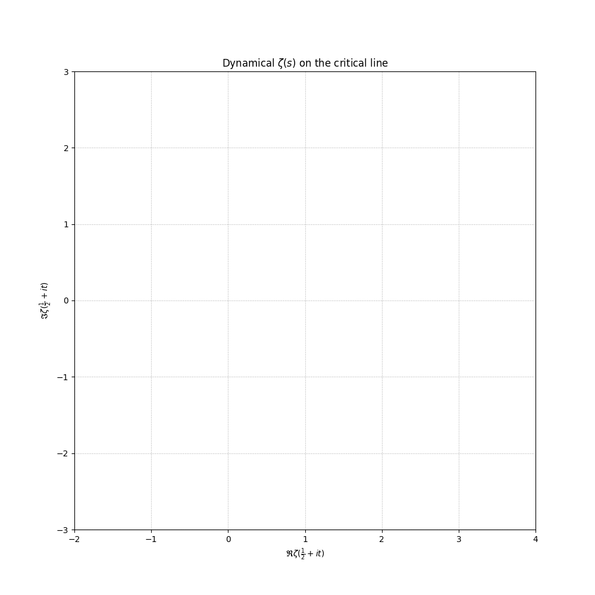

# Zeta Zero

计算 Riemann $\zeta$ 函数的非平凡零点.

有传言说他们都位于复平面 $\mathfrak{Re}(s)=\frac{1}{2}$ 的临界线上.

Calculate the non-trivial zeros of the Riemann $\zeta$ function.

There is a rumor that they are all on the critical line of the complex plane $\mathfrak{Re}(s)=\frac{1}{2}$.

